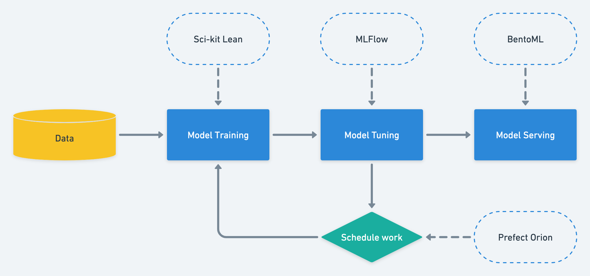

# mlops-best-practice
MLOps best practice focus on model training performance monitoring, built pipeline, and model serving. Using MLFlow, Sci-kit Learn, Prefect, and BentoML.


> ref: https://makeameme.org/meme/practice-makes-perfect-b054400446

## MLOps 的練習場
最近在研究 MLOps 的相關技術，這邊紀錄一下練習的過程。
目前使用的技術有：
- [Sci-kit Learn](https://github.com/scikit-learn/scikit-learn)
  - 經典的機器學習套件
  - 目前會使用 Support Vector Machine Classifier 來做分類
  - 資料集使用 [Breast Cancer Wisconsin (Diagnostic) Data Set](https://scikit-learn.org/stable/modules/generated/sklearn.datasets.load_breast_cancer.html)
- [MLFlow](https://github.com/mlflow/mlflow)
  - 用來追蹤模型訓練的過程，包括但不限於模型參數、訓練資料、訓練時間、訓練結果等等。
- [Prefect Orion](https://github.com/PrefectHQ/prefect)
  - 用來建立模型訓練的 pipeline，並且可以透過 Web GUI 來觀察 pipeline 的狀態。
  - 類似於 Airflow，但是比 Airflow 更簡單易用。
  - 同類型的工具還有 Kubeflow Pipelines、Argo Workflows、dagster 等等。
- [BentoML](https://github.com/bentoml/BentoML)
  - 用來將訓練好的模型打包成 API、Container、Serverless 等等，並且可以透過 Web GUI 來觀察模型的狀態。
  - 同類型的工具還有 Kubeflow、MLFlow 等等。

## 架構

## 環境
- Python 3.8+
- mlflow 2.0.1

## 文章
1. [【MLOps 練習場 1】使用 MLFlow 監控模型訓練優化成效——以 Sci-kit Learn 為例子](https://medium.com/@NeroHin/mlops-%E7%B7%B4%E7%BF%92%E5%A0%B4-1-%E4%BD%BF%E7%94%A8-mlflow-%E7%9B%A3%E6%8E%A7%E6%A8%A1%E5%9E%8B%E8%A8%93%E7%B7%B4%E5%84%AA%E5%8C%96%E6%88%90%E6%95%88-%E4%BB%A5-sci-kit-learn-%E7%82%BA%E4%BE%8B%E5%AD%90-a4d4c3dd7145)
2. 【MLOps 練習場 2】使用 Prefect 來執行 Pipeline 和 Re-training 吧！
3. 【MLOps 練習場 3】使用 BentoML 將模型打包投入服務

## How to run
1. Install dependencies
```bash
pip install -r requirements.txt
```
2. Run MLFlow server with Docker
```bash
cd mlops-best-practice
docker run
```
